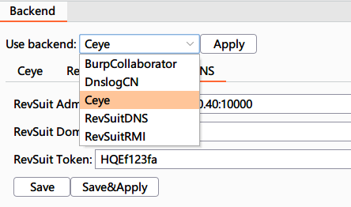
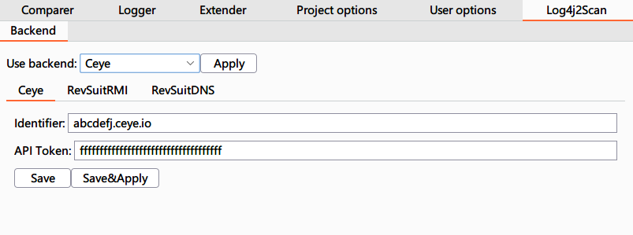
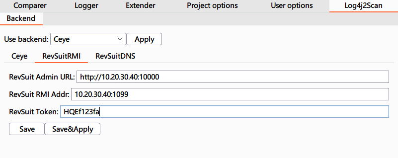
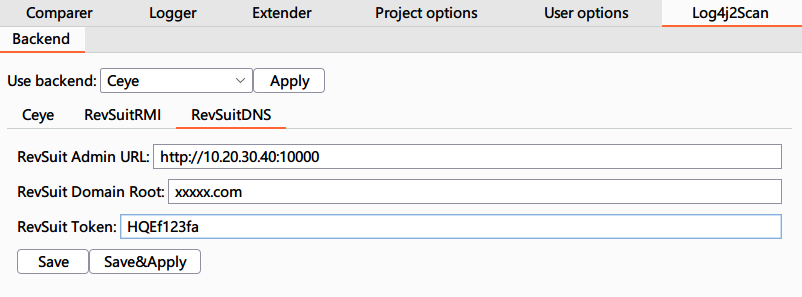
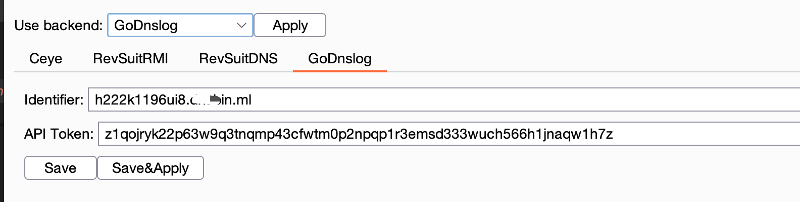
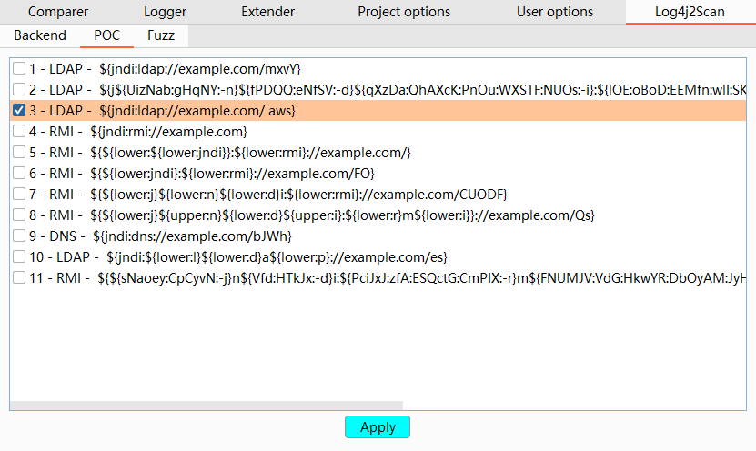
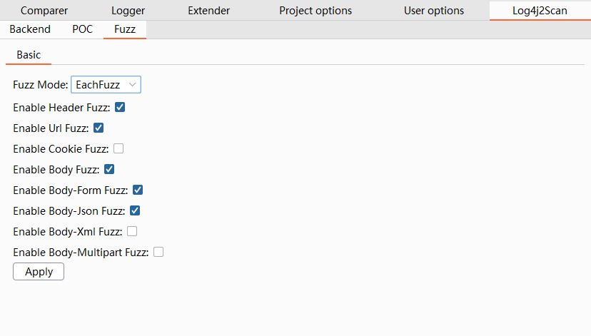

# Log4j2Scan

> 本工具仅供学习研究自查使用，切勿用于非法用途，由使用该工具产生的一切风险均与本人无关！

> dnslog.cn由于请求人数过多，时有无法访问接口的问题，若出现无法扫描的情况时，请尝试通过菜单切换dnslog平台。

[English](./README.md) | 简体中文

Log4j2 远程代码执行漏洞，BurpSuite被动扫描插件。

支持精确提示漏洞参数、漏洞位置，支持多dnslog平台扩展、自动忽略静态文件。

支持两种扫描模式：
- EachFuzz  -  对每个参数进行单独Fuzz，准确度最高。
- Crazy     -  同时对请求中的所有参数进行Fuzz，一个POC将只请求一次，降低网络压力，但是将有几率发生遗漏。

漏洞检测暂只支持以下类型
- Url
- Cookie
- Header
- Body(x-www-form-urlencoded、json、xml、multipart)

# ChangeLog
### 2021/12/14
##### v0.9
1. 加入GoDnslog的后端支持，感谢 @54Pany 。
2. 加入Fuzz设置界面。
3. 加入POC设置界面。
4. 加入 Body(json、xml、multipart) fuzz的支持。
5. 优化header请求逻辑，降低请求数量。
### 2021/12/13
##### v0.8.1
1. 绕过dnslog.cn的异常访问过滤。
##### v0.8
1. 添加dnslog设置界面，支持多dnslog平台实时切换。
2. 添加 [RevSuit](https://github.com/Li4n0/revsuit/)-DNS 的后端支持。
### 2021/12/13
##### v0.7
1. 加入 [RevSuit](https://github.com/Li4n0/revsuit/)-RMI 的后端支持。
2. 修复由于域名查询被服务器小写化导致的漏报问题。
### 2021/12/12
##### v0.6
1. 加入静态文件过滤。
2. 加入多POC支持，共十种poc变种，默认启用POC1~4。
3. 加入burpcollaborator的dnslog支持，默认使用dnslog.cn。
### 2021/12/11
##### v0.5
1. 加入Header的fuzz功能。
##### v0.4
1. 加入RC1补丁的绕过poc。

# 效果截图

# 微信交流群

# 鸣谢
插件中部分代码借鉴于以下项目

https://github.com/pmiaowu/BurpShiroPassiveScan/
