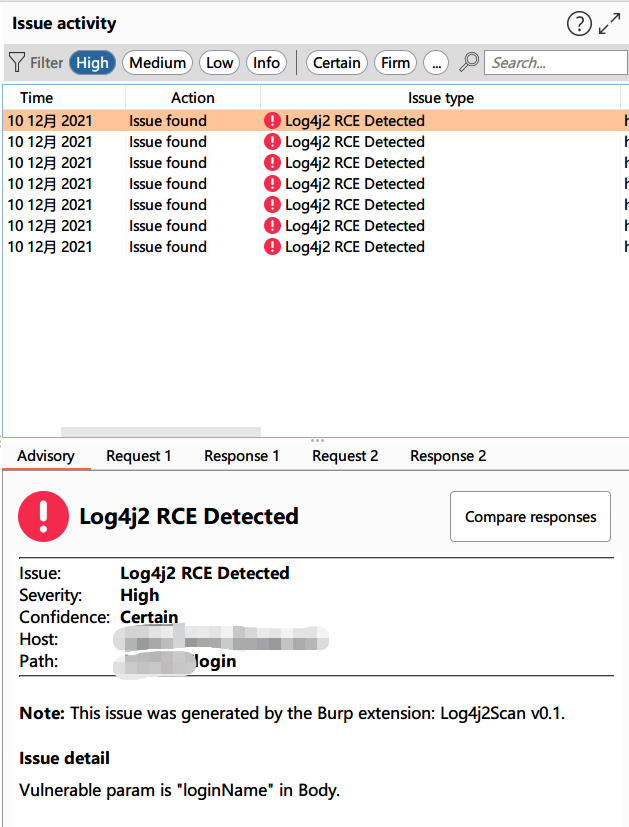

# Log4j2Scan

> 本工具仅供学习研究自查使用，切勿用于非法用途，由使用该工具产生的一切风险均与本人无关！

> dnslog.cn由于请求人数过多，时有无法访问接口的问题，若出现无法扫描的情况时，请确认插件日志中是否提示Dnslog加载成功，或者根据下方的方法设置dnslog为ceye.io

Log4j2 远程代码执行漏洞，BurpSuite被动扫描插件。

支持精确提示漏洞参数、漏洞位置，支持多dnslog平台扩展、自动忽略静态文件。

漏洞检测暂只支持以下类型
- Url
- Cookie
- Header
- Body(x-www-form-urlencoded)

# ChangeLog
### 2021/12/12
##### v0.6
1. 加入静态文件过滤。
2. 加入多POC支持，共十种poc变种，默认启用POC1~4。
3. 加入burpcollaborator的dnslog支持，默认使用dnslog.cn。
### 2021/12/11
##### v0.5
1. 加入Header的fuzz功能。
##### v0.4
1. 加入RC1补丁的绕过poc。

# 效果截图

# 修改Dnslog平台

因为没有太多的时间去开发界面，有修改dnslog平台需求的可以先临时使用以下方法手动切换Dnslog平台为`ceye.io`

1. 下载源码使用任意IDE打开。
2. Ceye.java 里需要修改"rootDomain"、"token"的值，对应ceye的profile页面中的Identifier、API Token。
3. Log4j2Scanner.java里需要将`this.dnslog = new DnslogCN();`修改为`this.dnslog = new Ceye();`
4. 使用`mvn package`重新打包项目。

# 鸣谢
插件中部分代码借鉴于以下项目

https://github.com/pmiaowu/BurpShiroPassiveScan/
